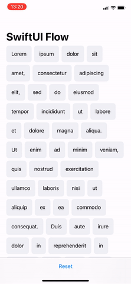

# SwiftUI Flow

SwiftUI views that arrange their children in a flow layout.



## HFlow
A view that arranges its children in a horizontal flow.

### Usage
```swift
ScrollView(.horizontal) {
    HFlow {
        //Flow content
    }
}
```

### Parameters
* `horizontalSpacing`: The distance between adjacent columns of subviews, or `nil` if you want the flow to choose a default distance for each pair of columns.
* `verticalSpacing`: The distance between vertically adjacent subviews, or `nil` if you want the flow to choose a default distance for each pair of subviews.
* `content`: A view builder that creates the content of this flow.

## VFlow
A view that arranges its children in a vertical flow.

### Usage
```swift
ScrollView(.vertical) {
    VFlow {
        //Flow content
    }
}
```

### Parameters
* `horizontalSpacing`: The distance between horizontally adjacent subviews, or `nil` if you want the flow to choose a default distance for each pair of subviews.
* `verticalSpacing`: The distance between adjacent rows of subviews, or `nil` if you want the flow to choose a default distance for each pair of rows.
* `content`: A view builder that creates the content of this flow.

## Requirements

* iOS 14.0+, macOS 11.0+, tvOS 14.0+ or watchOS 7.0+
* Xcode 12.0+

## Installation

* Install with [Swift Package Manager](https://developer.apple.com/documentation/xcode/adding_package_dependencies_to_your_app).
* Import `SwiftUIFlow` to start using.

## Contact

[@ciaranrobrien](https://twitter.com/ciaranrobrien) on Twitter.
